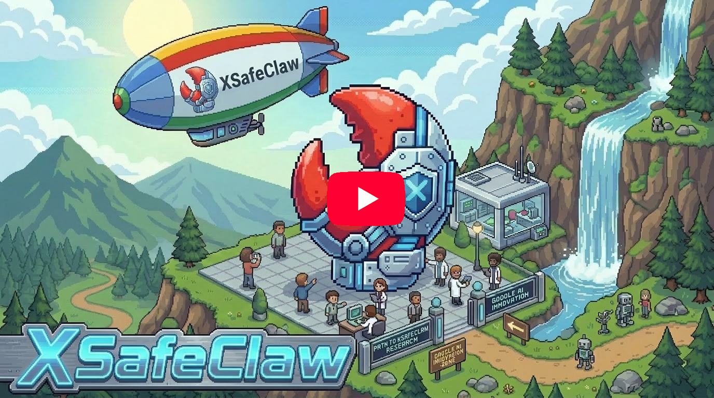

[English](README.md) · [中文文档](README_zh.md)

# XSafeClaw

[](https://www.python.org/downloads/)
[](https://fastapi.tiangolo.com/)
[](https://react.dev/)
[](https://opensource.org/licenses/MIT)

<div align="center">


**Build, Monitor, and Secure Your Agents**

</div>

> AI agents are not just new software. They are software that can be talked into doing dangerous things. As agents move from chatbots to active systems that browse the web, execute code, and operate inside real workflows, we have handed language models the keys to our infrastructure before figuring out how to keep them on the rails.
>
> This breaks traditional security assumptions entirely. In conventional systems, behavior is defined in code. In agents, behavior emerges at runtime from instructions, retrieved content, memory, and long decision loops. An attacker no longer needs to exploit a bug. They can manipulate the agent's reasoning, redirect its trajectory, or turn small permissions into larger ones over time. Prompt injection, tool misuse, and silent privilege escalation are not edge cases. They are structural properties of the execution model. Most teams only discover this when reading logs after the fact. That is forensics, not security.
>
> **XSafeClaw** is built for that reality. It is an open-source defense platform that treats agent security as a live control problem, not a postmortem exercise. In the agent era, capability without defense is not progress. It is unmanaged exposure.

🚀 `<a href="#-quick-start">`Get Started`</a>` &nbsp;·&nbsp;
📖 `<a href="docs/installation.md">`Documentation`</a>` &nbsp;·&nbsp;
🌐 `<a href="https://xsafeclaw.ai">`Project Website`</a>` &nbsp;·&nbsp;
▶️ `<a href="https://youtu.be/HIqwFVeuiKs">`YouTube Demo`</a>`

---

## 🎬 Introducing XSafeClaw

<p align="center">
  <a href="https://youtu.be/HIqwFVeuiKs" title="XSafeClaw Introduction Video">
    
  </a>
</p>

---

## 📰 News

`<sub>`Release notes and project milestones.`</sub>`

|    | Date       | Update                                                                                                                                                                                                             |
| :-: | :--------- | :----------------------------------------------------------------------------------------------------------------------------------------------------------------------------------------------------------------- |
| 🛠️ | 2026-04-25 | **v1.0.4 released** — PyPI packaging now explicitly includes the embedded frontend bundle, fixing the `Frontend not built` regression from `1.0.3`. |
| 🎉 | 2026-04-25 | **v1.0.3 released** — XSafeClaw now publicly supports OpenClaw, nanobot, 和 Hermes side by side, 和 fixes several known bugs. |
|  🧩   | 2026-04-23 | **Hermes and runtime autostart** — XSafeClaw now discovers OpenClaw, Hermes, 和 nanobot side by side, 和 best-effort starts installed gateways when the server boots. |
|  🐈   | 2026-04-18 | **nanobot local runtime support** — XSafeClaw can now discover a local nanobot instance, start guarded chat sessions through `nanobot gateway`, 和 show mixed-runtime sessions together in Agent Valley. |
|  🚀   | 2026-04-13 | **v 1.0.0 released** — First public release of XSafeClaw with Claw Monitor, Safe Chat, Asset Shield, Guard, Agent Office, 和 Onboard Setup. |

---

## 🔍 What is XSafeClaw?

XSafeClaw is an open-source safety platform for AI agents, built to make agent behavior visible, controllable, and trustworthy. It turns complex agent execution into an intuitive visual “Safe Agent Valley,” providing real-time monitoring, risk interception, human-in-the-loop governance, and automated red-team testing — all accessible through a single `xsafeclaw start` command. The current runtime registry discovers local OpenClaw, Hermes Agent, and nanobot installations side by side, then lets you choose the runtime per session in Agent Town.

| Module                     | Description                                                                                                                                               |
| :------------------------- | :-------------------------------------------------------------------------------------------------------------------------------------------------------- |
| **Claw Monitor**     | Real-time session timeline with event tracking, token usage, tool call inspection, skills & memory scanning across OpenClaw, Hermes, and nanobot sessions |
| **Safe Chat**        | Secure chat with OpenClaw, Hermes, or nanobot through each runtime's gateway/API                                                                          |
| **Asset Shield**     | File system scanning with risk classification (L0–L3), software audit, hardware inventory                                                                |
| **Guard (AgentDoG)** | Trajectory-level & tool-call-level safety evaluation with human-in-the-loop approval                                                                      |
| **Agent Office**     | PixiJS-powered 2D visualization of all agents' status and activities                                                                                      |
| **Onboard Setup**    | Interactive setup for OpenClaw, Hermes, and nanobot, including model configuration and runtime guard integration                                          |

---

## 🚀 Quick Start

```bash
pip install xsafeclaw
xsafeclaw start
```

Browser opens automatically at `http://127.0.0.1:6874`. If no supported runtime is installed, the web UI guides you through OpenClaw, Hermes, or nanobot setup.

Common options:

```bash
xsafeclaw start --port 8080              # custom port
xsafeclaw start --host 0.0.0.0           # accessible from LAN
xsafeclaw start --no-browser --reload    # headless dev mode
```

<!-- <p align="center"></p> -->

---

## 🛡️ Guard: How It Works

XSafeClaw's guard system protects users through a two-layer defense:

1. **Trajectory-level evaluation** — The full conversation history is sent to a guard model (AgentDoG) that evaluates the entire interaction sequence for emerging risks across multiple turns.
2. **Tool-call interception** — Every tool call passes through a `before_tool_call` hook. If the guard model deems it unsafe, the call is held in a pending queue for human review.

```
Agent wants to run a tool
        │
        ▼
  Guard Model evaluates
        │
   ┌────┴────┐
   │         │
  Safe     Unsafe
   │         │
   ▼         ▼
 Execute   Hold for human review
           ┌────┴────┐
           │         │
        Approve    Reject
           │         │
           ▼         ▼
        Execute   Block + notify agent
```

When rejected (or timed out after 5 min), the agent is instructed to **stop all subsequent actions**, **inform the user about the risk**, and **wait for explicit confirmation**.

---

## 🏗️ Architecture

```
                         Browser (:6874)
                              │
                  ┌───────────┴───────────┐
                  │     FastAPI Server     │
                  ├───────────────────────┤
                  │   Runtime Registry     │◄── OpenClaw / Hermes / nanobot discovery
                  │   Runtime Autostart    │◄── best-effort gateway startup
                  │   Guard Service        │◄── AgentDoG model
                  │   File Watcher         │◄── runtime JSONL sessions
                  │   Asset Scanner        │◄── file/software/hardware scanning
                  └───────────┬───────────┘
                              │
                    SQLite DB │ ~/.xsafeclaw/
                              │
          ┌───────────────────┼───────────────────┐
          │                   │                   │
    OpenClaw Agent      Hermes Agent          nanobot Agent
    safeclaw plugin     Hermes plugin         XSafeClaw hook
    ws://:18789         http://:8642          gateway + websocket
          └───────────────────┴───────────────────┘
                              │
                   POST /api/guard/tool-check
```

| Layer       | Technology                                                           |
| :---------- | :------------------------------------------------------------------- |
| Backend     | Python 3.11, FastAPI, SQLAlchemy (async), uvicorn                    |
| Frontend    | React 19, TypeScript, Vite, Tailwind CSS 4                           |
| Database    | SQLite (via aiosqlite)                                               |
| Guard Model | AgentDoG (configurable base URL & model)                             |
| Runtimes    | Local OpenClaw, Hermes Agent, and nanobot with per-session selection |

Full API docs available at `http://localhost:6874/docs` when running.

---

## 📦 Installation

For detailed installation procedures, see the **[installation guide](docs/installation.md)**.

> [!TIP]
> Requires Python 3.11+. Published packages include the frontend bundle. Source checkouts should run `cd frontend && npm run build` for the embedded backend UI, or use the Vite dev server.

```bash
# From PyPI (recommended)
pip install xsafeclaw

# From GitHub
pip install git+https://github.com/XSafeAI/XSafeClaw.git

# From source
git clone https://github.com/XSafeAI/XSafeClaw.git
cd XSafeClaw && pip install .

# Development
git clone https://github.com/XSafeAI/XSafeClaw.git
cd XSafeClaw && pip install -e ".[dev]"
```

### 🔌 Install the Guard Plugin

The Setup and Configure flows install the matching Guard integration automatically. If you are wiring runtimes manually, use the runtime-specific path below.

For OpenClaw, copy the TypeScript plugin:

```bash
cp -r plugins/safeclaw-guard ~/.openclaw/extensions/safeclaw-guard
```

Then add to `~/.openclaw/openclaw.json`:

```json
{
  "plugins": {
    "entries": {
      "safeclaw-guard": {
        "path": "~/.openclaw/extensions/safeclaw-guard"
      }
    }
  }
}
```

For Hermes, copy the Python plugin to Hermes' plugin directory:

```bash
mkdir -p ~/.hermes/plugins/safeclaw-guard
cp -r plugins/safeclaw-guard-hermes/* ~/.hermes/plugins/safeclaw-guard/
```

For nanobot, copy the Python plugin and keep the XSafeClaw package available in nanobot's uv tool environment:

```bash
mkdir -p ~/.nanobot/plugins/safeclaw-guard
cp -r plugins/safeclaw-guard-nanobot/* ~/.nanobot/plugins/safeclaw-guard/
uv tool install nanobot-ai --with-editable . --force
```

The Nanobot config page does this automatically when you save: it copies the plugin, writes the hook entry to `~/.nanobot/config.json`, and deploys `SAFETY.md` / `PERMISSION.md` into the nanobot workspace. The plugin injects those safety templates into every nanobot agent turn and checks tool calls through XSafeClaw Guard.

Provider, model, and API key are intentionally blank until you configure them.

For compatibility, the legacy setup endpoint still exists and creates only a skeleton config without provider/model defaults:

```bash
curl -X POST http://127.0.0.1:6874/api/system/nanobot/init-default
```

### Runtime Gateways

XSafeClaw best-effort auto-starts installed runtimes at server boot and after setup:

- OpenClaw: `openclaw gateway start --json`, default `ws://127.0.0.1:18789`.
- Hermes: enables the HTTP API and starts/restarts `hermes gateway`, default `http://127.0.0.1:8642`.
- nanobot: detached `nanobot gateway --port <configured-port>`, default health port `18790` and WebSocket channel `ws://127.0.0.1:8765/`.

Manual commands are still useful for troubleshooting:

```bash
openclaw gateway start
hermes gateway
nanobot gateway --port 18790 --verbose
```

If you edit runtime config files by hand, restart the affected gateway so it reloads the new settings. `nanobot serve` is not required for the current integration.

---

## ⚙️ Configuration

XSafeClaw works out of the box with sensible defaults. Copy `.env.example` to `.env` to customize:

| Variable                                  | Default                                       | Description                                                                                                         |
| :---------------------------------------- | :-------------------------------------------- | :------------------------------------------------------------------------------------------------------------------ |
| `API_PORT`                              | `6874`                                      | XSafeClaw API port                                                                                                  |
| `API_HOST`                              | `0.0.0.0`                                   | Bind address                                                                                                        |
| `DATA_DIR`                              | `~/.xsafeclaw`                              | SQLite database and local state directory                                                                           |
| `PLATFORM`                              | `auto`                                      | Default-instance hint:`auto`, `openclaw`, `hermes`, or `nanobot`; all discovered runtimes remain selectable |
| `AUTO_START_RUNTIMES`                   | `true`                                      | Best-effort gateway autostart for installed OpenClaw, Hermes, and nanobot runtimes                                  |
| `OPENCLAW_SESSIONS_DIR`                 | `~/.openclaw/agents/main/sessions`          | OpenClaw session directory                                                                                          |
| `HERMES_HOME`                           | `~/.hermes`                                 | Hermes home directory                                                                                               |
| `HERMES_API_PORT`                       | `8642`                                      | Hermes HTTP API port                                                                                                |
| `HERMES_API_KEY`                        | *(empty)*                                   | Must match `API_SERVER_KEY` in `~/.hermes/.env`                                                                 |
| `~/.nanobot/config.json`                | *(created when saved in Nanobot Configure)* | nanobot config, gateway, workspace, WebSocket, and XSafeClaw hook settings                                          |
| `GUARD_BASE_URL` / `GUARD_BASE_MODEL` | AgentDoG defaults                             | Guard model endpoint and model ID                                                                                   |

OpenClaw configuration lives in `~/.openclaw/openclaw.json`, Hermes in `~/.hermes/.env` and `~/.hermes/config.yaml`, and nanobot in `~/.nanobot/config.json`. See `.env.example` for the full list.

---

## 🔧 Development

Prerequisites: Python 3.11+, Node.js 18+, [uv](https://docs.astral.sh/uv/) (recommended)

```bash
# Install uv project manager (if you don't already have it) 
curl -LsSf https://astral.sh/uv/install.sh | sh   
```

```bash
git clone https://github.com/XSafeAI/XSafeClaw.git && cd XSafeClaw

# Backend
uv venv && uv pip install -e ".[dev]"
python run.py                    # http://localhost:6874, auto-reload

# Optional runtime CLIs for local testing
uv tool install nanobot-ai --with-editable . --force
openclaw gateway start
hermes gateway
nanobot gateway --port 18790 --verbose

# Frontend (separate terminal)
cd frontend && npm install && npm run dev   # http://localhost:3003, HMR

# Build frontend for production
cd frontend && npm run build     # outputs ignored Vite artifacts to src/xsafeclaw/static/
```

For the repository dev loop on Linux/macOS, `bash setup.sh` installs backend and frontend dependencies once, and `bash start.sh` runs Vite on `:6874` with the FastAPI backend proxied on `:3022`.

---

## ⭐ Star History

<a href="https://app.repohistory.com/star-history?repo=XSafeAI/XSafeClaw">
  <picture>
    <source
      media="(prefers-color-scheme: dark)"
      srcset="https://app.repohistory.com/api/svg?repo=XSafeAI/XSafeClaw&type=Date&background=0D1117&color=f86262"
    />
    <source
      media="(prefers-color-scheme: light)"
      srcset="https://app.repohistory.com/api/svg?repo=XSafeAI/XSafeClaw&type=Date&background=FFFFFF&color=f86262"
    />
    
  </picture>
</a>

---

## 🙏 Acknowledgements

- [**OpenClaw**](https://github.com/openclaw/openclaw) — The personal AI assistant platform that XSafeClaw is designed to protect. OpenClaw's open plugin architecture makes our guard integration possible.
- [**Hermes Agent**](https://github.com/NousResearch/hermes-agent) — The local Python agent runtime and multi-platform gateway now supported as a first-class XSafeClaw runtime.
- **nanobot** — The lightweight local agent runtime integrated through XSafeClaw's gateway, WebSocket, and Python hook support.
- [**AgentDoG**](https://github.com/AI45Lab/AgentDoG) — The diagnostic guardrail framework for AI agent safety. XSafeClaw's guard module is powered by AgentDoG's trajectory-level risk assessment and fine-grained safety taxonomy.
- [**ISC-Bench**](https://github.com/wuyoscar/ISC-Bench) — Research on Internal Safety Collapse in frontier LLMs. ISC-Bench's insights into task-completion-driven safety failures have informed our red team testing design.
- [**AgentHazard**](https://github.com/Yunhao-Feng/AgentHazard) — A benchmark for evaluating harmful behavior in computer-use agents. AgentHazard's attack taxonomy and execution-level risk categories have shaped our threat modeling.

---

## ⚠️ Disclaimer

> [!CAUTION]
> XSafeClaw is a research tool intended for **improving the safety of AI agent systems**. The red team testing features are designed exclusively for defensive security research and evaluation purposes. **Do not use this tool to cause harm or engage in any malicious activities.**

---

## 💼 Commercial Use

XSafeClaw is open-sourced under the MIT License for academic research and personal use. For **commercial licensing, enterprise deployment, or collaboration**, please contact:

**Email:** xingjunma&#64;fudan.edu.cn

---

## 👥 Contributors

<a href="https://github.com/XSafeAI/XSafeClaw/graphs/contributors">
  
</a>

We welcome contributions of all kinds — bug reports, feature requests, documentation, and code.

---

## 📄 License

[MIT](LICENSE)
