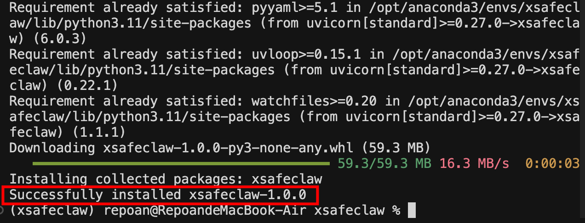
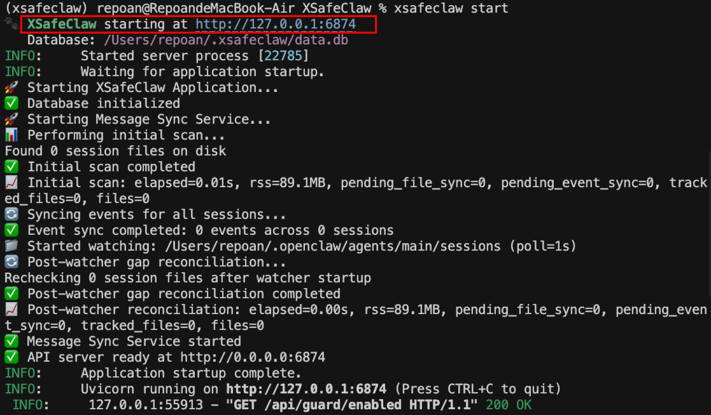
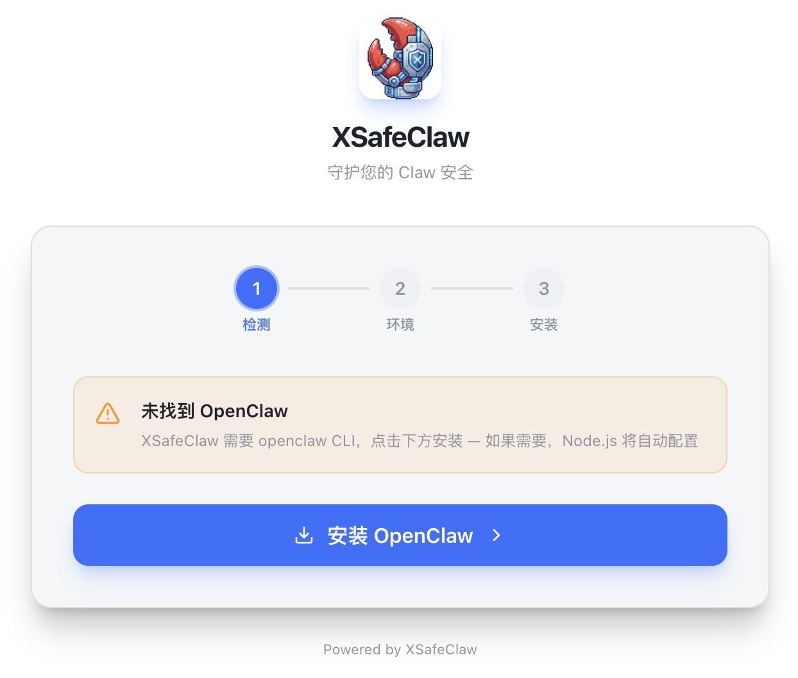
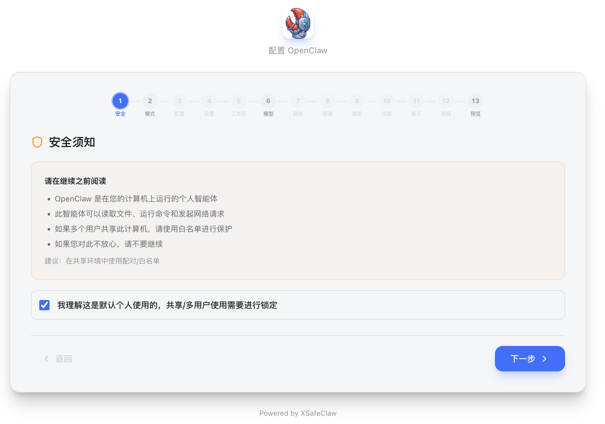
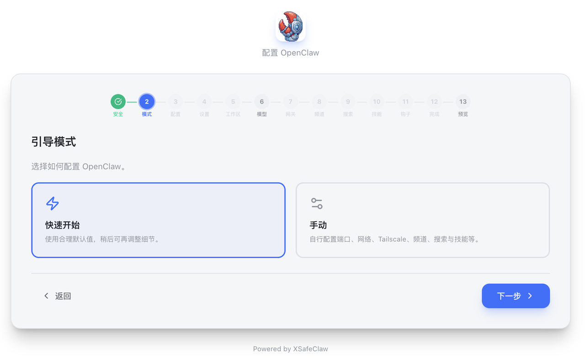
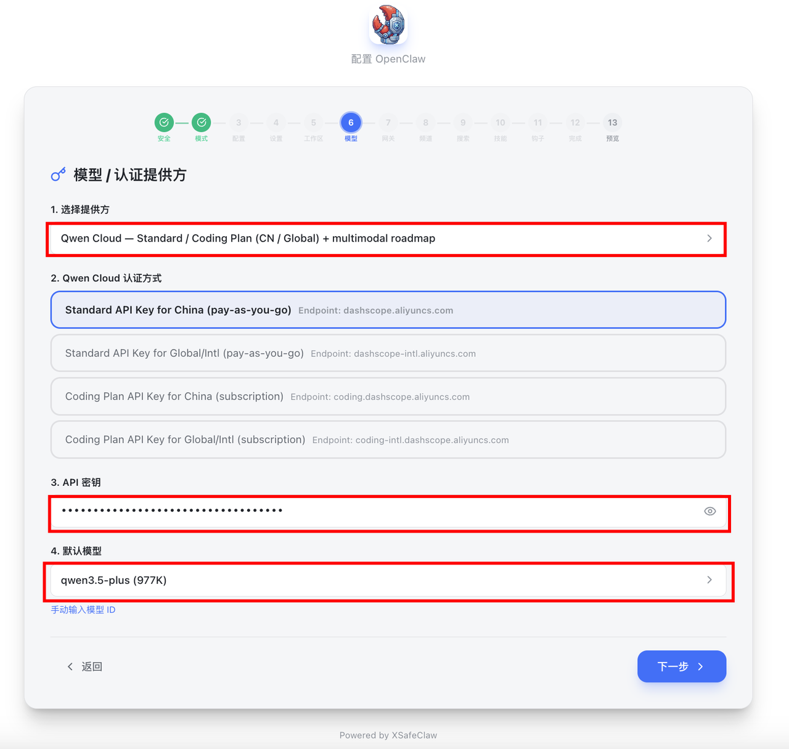
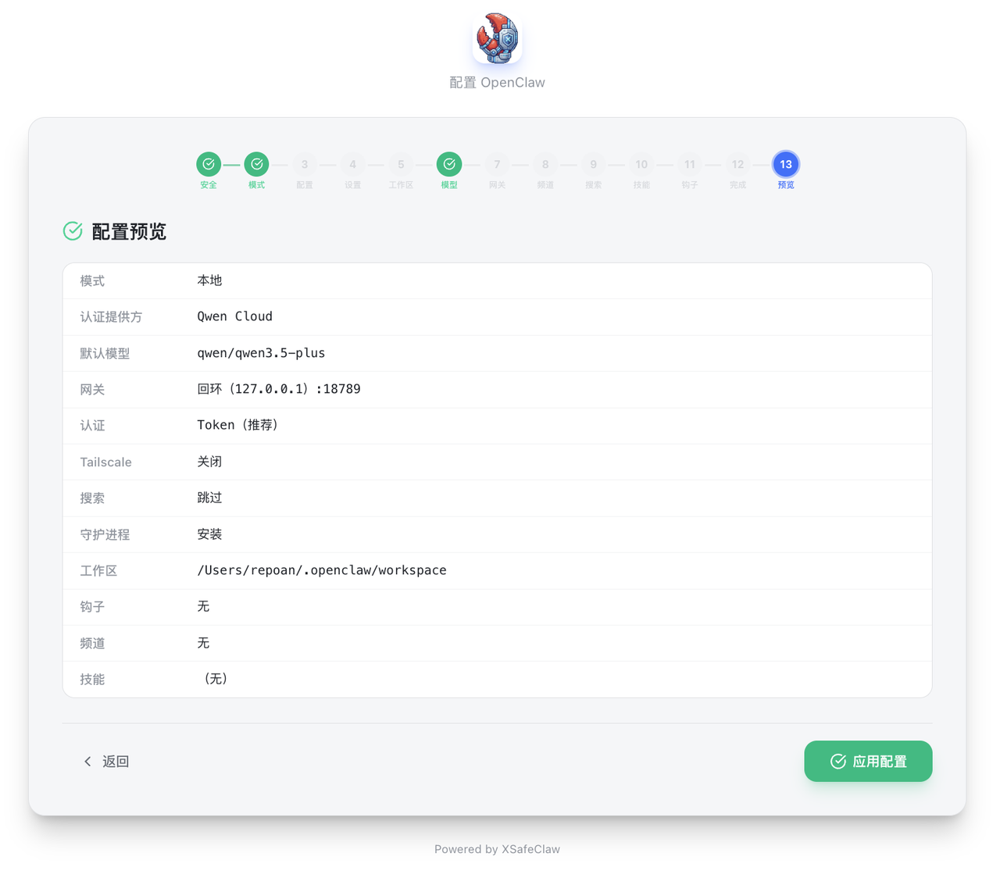
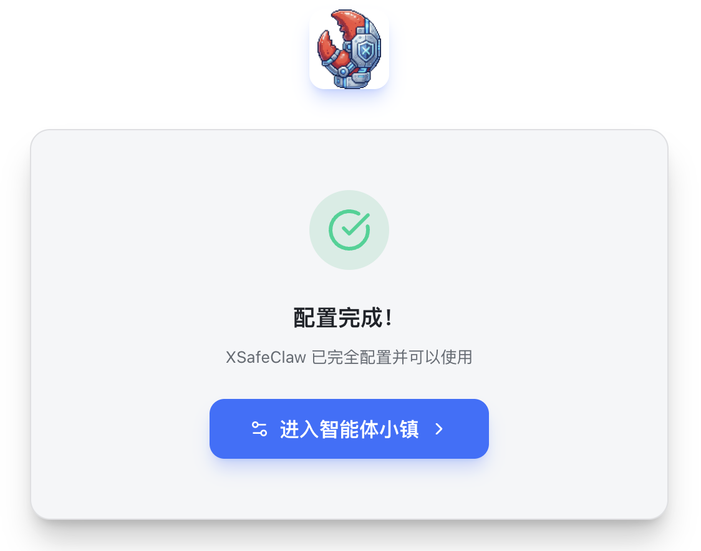
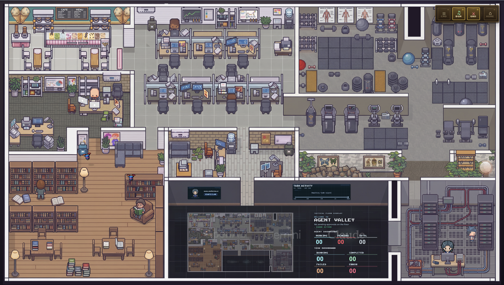

# XSafeClaw 安装指南

**环境要求：** Python ≥ 3.11，支持 macOS、Linux、Windows。下文命令均在终端中执行（Windows：PowerShell / 命令提示符；macOS：终端；Linux：Terminal）。

---

## 一、环境准备

### 1. 确认 Python 版本

```bash
python3 --version
```

版本应为 **3.11.x** 或更高。

### 2. 安装 Python（若尚未安装）

- **macOS：** `brew install python@3.11` 或从官网下载安装包；在终端执行 `python3 --version` 确认。
- **Linux：** `sudo apt install python3.11 python3.11-venv python3-pip`（发行版不同时包名可能略有差异）。
- **Windows：** 从 [python.org/downloads](https://www.python.org/downloads/) 安装，勾选 **Add python.exe to PATH**，安装完成后重新打开终端。

---

## 二、安装 XSafeClaw

```bash
python3 -m pip install xsafeclaw
```

<p align="center">
  
</p>

---

## 三、启动

```bash
xsafeclaw start
```

首次运行一般会**自动打开浏览器**进入引导页；若未打开，请在浏览器访问：**http://127.0.0.1:6874**。

<p align="center">
  
</p>

---

## 四、OpenClaw 安装引导

未检测到 OpenClaw 时，请按页面提示操作，顺序一般为：

### 1. 安装 OpenClaw

打开 **http://127.0.0.1:6874/setup** ，按页面提示安装 OpenClaw。

<p align="center">
  
</p>

### 2. 安全须知

打开 **http://127.0.0.1:6874/configure** ，在**安全须知**处勾选确认。

<p align="center">
  
</p>

### 3. 引导模式

选择 **「快速开始」**（或按需选择手动模式）。

<p align="center">
  
</p>

### 4. 模型与 API Key

选择模型提供方（例如 Qwen Cloud）→ 点击 **「获取密钥」** 申请 API Key，并粘贴到页面中。

<p align="center">
  
</p>

### 5. 应用配置

在**配置总览**中核对无误后，点击应用。

<p align="center">
  
</p>

### 6. 进入工作台

<p align="center">
  
</p>

初始化成功后，点击蓝色的 **「进入智能体小镇」** 按钮，即可进入像素风工作台界面，Agent 已在此待命。

<p align="center">
  
</p>

---

## 五、进阶启动选项（开发者 / 服务器）

在远程服务器（如 Linux）上使用，或需要自定义监听地址与端口时，可使用命令行参数：

```bash
# 监听所有网卡（便于远程访问），指定端口
xsafeclaw start --host 0.0.0.0 --port 6874

# 不自动打开浏览器（适合无图形界面环境）
xsafeclaw start --no-browser

# 开发模式：代码变更后自动重载
xsafeclaw start --reload
```

常用参数说明：

| 参数 | 简写 | 说明 |
|------|------|------|
| `--port` | `-p` | 服务端口，默认 `6874` |
| `--host` | `-h` | 绑定地址，默认 `127.0.0.1` |
| `--no-browser` | | 启动后不自动打开浏览器 |
| `--reload` | | 开启自动重载（开发用） |
