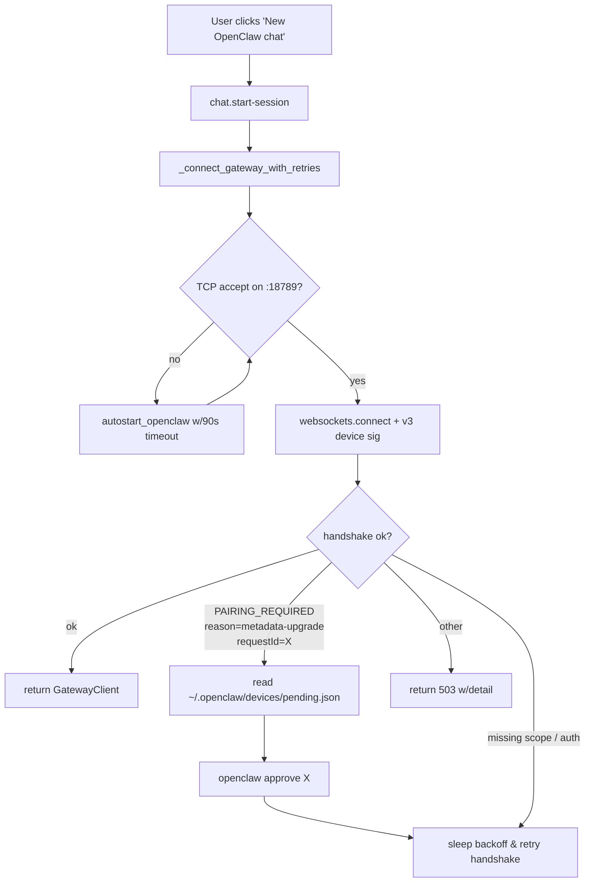

# OpenClaw 2026.4.25 适配实施总结

> 适用范围：XSafeClaw ↔ OpenClaw 集成  
> 目标版本：`OpenClaw 2026.4.25 (aa36ee6)`  
> 不涉及：Hermes、Nanobot 及其客户端/路由，前端静态页面

---

## 1. 背景与故障现象

用户在 `2026-04-25` 升级 OpenClaw 后出现以下现象：

- 前端 `http://localhost:3003/chat` 新建 OpenClaw 会话时弹窗：
  > Failed to connect to OpenClaw gateway after 6 attempts: Failed to connect to OpenClaw gateway. Is the gateway running? Check with `openclaw status`. device_auth_error=[WinError 1225] 远程计算机拒绝网络连接。; token_auth_error=[WinError 1225] 远程计算机拒绝网络连接。. The gateway may still be restarting.
- 后端日志出现循环：
  ```
  [openclaw-autostart] status=failed detail=`openclaw gateway start` exited rc=124: timeout after 10s
  ⚠️  Device auth failed, falling back to token-only auth...
  INFO:     ... "POST /api/chat/start-session HTTP/1.1" 503 Service Unavailable
  ```
- OpenClaw CLI 本身 `openclaw devices list --json` 等子命令会报 `gateway timeout after 10000ms`。

## 2. 根因分析（无需下载 OpenClaw 源码）

仅凭下列三个信息源即可完整定位：

1. 本地已安装的 OpenClaw dist：`C:\Users\<user>\AppData\Roaming\npm\node_modules\openclaw\dist\*`  
   尤其是 `plugin-sdk/src/gateway/protocol/connect-error-details.d.ts`
2. OpenClaw 状态目录：`~/.openclaw/openclaw.json`、`~/.openclaw/devices/{paired,pending}.json`
3. 网关运行日志：`%TEMP%\openclaw\openclaw-YYYY-MM-DD.log`

三个在 4.25 里变得有害的 XSafeClaw 行为（均可在本项目内闭环修复）：

| # | 问题 | 具体表现 |
|---|------|----------|
| A | `autostart_openclaw` 固定 10s 超时 | 4.25 下插件加载 ~80s，`openclaw gateway start --json` 永远 rc=124 → 触发错误重启 |
| B | `chat._connect_gateway_with_retries` 把 autostart 当作任何连接失败时的万能重试 | 每次握手级错误（pairing / scope）都去重启 schtasks → 已绑定的 `127.0.0.1:18789` 被反复顶替 → TCP RST → `WinError 1225` |
| C | `auto_approve_pending_devices()` 依赖 `openclaw devices list --json` | 4.25 该命令改走 WS 网关鉴权；一旦正要修复的 pairing 循环存在，CLI 自己就死锁 |

4.25 的协议改动关键点（声明在 `connect-error-details.d.ts`）：

```text
ConnectErrorDetailCodes.PAIRING_REQUIRED
ConnectPairingRequiredReasons = {
  NOT_PAIRED, ROLE_UPGRADE, SCOPE_UPGRADE, METADATA_UPGRADE
}
```

典型错误文本：

```
pairing required: device identity changed and must be re-approved
(requestId: 8dd85120-00b8-41ea-a55f-119adfceb004)
```

本案例中，QQ Bot 插件 `native-approvals` 子设备的 `pinnedPlatform=linux`（历史遗留）与当前 `claimedPlatform=win32` 冲突，卡在 `metadata-upgrade` 循环；XSafeClaw 自己的设备 (`~/.xsafeclaw/openclaw-device.json`) 已正确 pin 为 `win32`，与配对记录一致。

## 3. 改动清单

| 文件 | 作用 |
|------|------|
| [`src/xsafeclaw/services/runtime_autostart.py`](../src/xsafeclaw/services/runtime_autostart.py) | `autostart_openclaw` 改写 |
| [`src/xsafeclaw/api/routes/chat.py`](../src/xsafeclaw/api/routes/chat.py) | `_connect_gateway_with_retries` 逻辑收敛 |
| [`src/xsafeclaw/gateway_client.py`](../src/xsafeclaw/gateway_client.py) | `auto_approve_pending_devices` 重写、`GatewayClient.connect` 适配 |
| [`README.md`](../README.md) / [`README_zh.md`](../README_zh.md) | 追加 4.25 兼容性小节 |

### 3.1 `services/runtime_autostart.py`

- 新增 `_probe_tcp_listener(host, port, timeout_s=1.5)`：`asyncio.open_connection` 握手成功即视为端口已绑定。这是 4.25 最可靠的 "listener up?" 信号，HTTP GET 不再权威。
- `autostart_openclaw(timeout_s=90.0)`：
  - 若 TCP 已 accept → 直接返回 `already_running`。
  - 否则执行 `openclaw gateway start --json`，给 90s 预算。
  - 若 `rc == 0`：HTTP 兜底等待（接受 `200/400/401/403/404/426/503`）或再次 TCP 检查，任一成功即 `started`。
  - 若 `rc != 0` 但 TCP 已 accept → 返回 `already_running`（CLI 的 WS 健康探测可能被 pairing/metadata 拒绝，但真实监听仍然正常为 XSafeClaw 的 device-signed connect 服务）。
  - 其余情况才返回 `failed`，并在 `detail` 中区分 "CLI timed out but listener bound" 与 "no listener bound after wait"。

### 3.2 `api/routes/chat.py`

- 新增模块级常量 `_GATEWAY_POST_AUTOSTART_BACKOFF_S = (1.0, 3.0, 8.0)`。
- 新增 `_is_transport_refused(exc)` 辅助函数，识别：
  - `ConnectionRefusedError`
  - `OSError.winerror in (1225, 10061)`
  - `OSError.errno == 111`
  - 字符串含 `WinError 1225` / `WinError 10061` / `ECONNREFUSED` / `Connection refused` / `[Errno 111]`
- `_connect_gateway_with_retries` 关键行为变化：
  - **仅当 `_is_transport_refused(last_error)` 为真时才调用 `autostart_openclaw(timeout_s=90.0)` / `autostart_hermes(timeout_s=20.0)`**；握手/鉴权/pairing 失败不再重启服务。
  - 刚触发过 autostart 的 N 次后续重试走指数退避 `1s → 3s → 8s`，避开 4.25 网关插件重载窗口；超出后退回平坦 `1s`。
  - 仍然保留 6 次重试与 503 退出语义，对上游调用方透明。

### 3.3 `gateway_client.py`

- 新增常量
  ```python
  _OPENCLAW_PENDING_JSON = Path.home() / ".openclaw" / "devices" / "pending.json"
  _APPROVE_SUBPROCESS_TIMEOUT_S = 45
  ```
- 抽出 `_find_openclaw_binary() -> str | None`：独立可复用，覆盖 PATH / nvm-sh / nvm-windows / Python Scripts/ / POSIX 常见目录。
- 新增 `_read_local_pending_requests() -> list[dict]`：直接解析 `~/.openclaw/devices/pending.json`（4.25 观察到的 shape 是 `{requestId: {…}}` dict；向后兼容 list）。**彻底替换** `openclaw devices list --json`。
- 重写 `auto_approve_pending_devices(*, preferred_request_id: str | None = None)`：
  1. 若传入 `preferred_request_id` → 先批这个；
  2. 扫描 pending.json 按 `deviceId == local_device_id` 或 `displayName contains "safeclaw"` 匹配本项目请求；
  3. 若仍为空 → 退化到 `openclaw approve --latest`；
  4. approve 子进程 timeout 从 15s 放宽到 **45s**；
  5. 新增 variant `openclaw pairing approve <requestId>`，与旧版 `openclaw devices approve <requestId>` 共存。
- 新增 `_extract_pairing_request_id(message: str) -> str | None`：正则 `requestId[:=]\s*"?(<UUID>)"?`，兼容 plain-text 错误与 JSON payload。
- `GatewayClient.connect()` 关键变化：
  - `retryable_device_error` 关键字扩展：增加 `"metadata-upgrade"` 与 `"pairing_required"`。
  - 命中 `"pairing"` / `"metadata-upgrade"` 时：抓取 `requestId`，打印 `🔑 Device pairing required — auto-approving requestId=…`，调用 `auto_approve_pending_devices(preferred_request_id=...)`，然后只重连一次即可生效。
  - `not-paired` / `scope-upgrade` 分支走既有路径。

### 3.4 README

在 `### Runtime Gateways` / `### 运行时 Gateway` 下新增子节 `OpenClaw 2026.4.25 compatibility notes` / `OpenClaw 2026.4.25 兼容性说明`：解释现象、说明 XSafeClaw 侧的缓解动作、给出一条手动止血命令 `openclaw approve --latest`。

## 4. 流程图



## 5. 验证

执行：

```powershell
$env:TMP="E:\github\XSafeClaw\.pytest_tmp_work"
$env:TEMP="E:\github\XSafeClaw\.pytest_tmp_work"
uv run pytest tests/test_gateway_client.py tests/test_nanobot_gateway_client.py tests/test_nanobot_runtime_guard.py -q
```

结果：

```
52 passed in 23.00s
```

其中 `test_gateway_connect_falls_back_to_token_only_on_device_connect_failure` 回归，确认改动对已有 token-only fallback 路径无影响。

导入冒烟测试：

```bash
python -c "from xsafeclaw.gateway_client import auto_approve_pending_devices, _extract_pairing_request_id; \
from xsafeclaw.services.runtime_autostart import autostart_openclaw, _probe_tcp_listener; \
from xsafeclaw.api.routes.chat import _is_transport_refused; print('ok')"
# → ok
```

## 6. 用户一键止血

```powershell
openclaw approve --latest
```

批准 `~/.openclaw/devices/pending.json` 中历史遗留的 `metadata-upgrade` pending 请求（通常是 QQ Bot `native-approvals` 插件），然后重启 `python run.py`。之后的连接会走新的 autostart/retry 逻辑，不再出现 `WinError 1225` 重启风暴。

## 7. 不改动范围（显式列出便于审阅）

- `src/xsafeclaw/hermes_client.py`
- `src/xsafeclaw/nanobot_gateway_client.py`
- `services/runtime_autostart.py::autostart_hermes` / `autostart_nanobot`
- `api/routes/chat.py` 中所有 Hermes / Nanobot 分支
- 前端静态页：`setup.html`、`openclaw_configure.html`、`chat.html`、`agent-valley.html`、`monitor.html`、`approvals.html` —— OpenClaw 的对外协议无破坏性变化，前端无需调整。

## 8. 风险与后续观察点

| 风险 | 缓解 |
|------|------|
| OpenClaw 未来若再次改名 `approve` 子命令 | `_approve_with_variants` 已同时支持 `approve` / `devices approve` / `pairing approve` 三种 shape。 |
| `pending.json` 缺失（全新环境） | `auto_approve_pending_devices` 会退化到 `openclaw approve --latest`。 |
| 90s 启动预算对 CI 无插件环境的影响 | `_probe_tcp_listener` 在端口已绑定时立即返回，真实开销仍然 <100ms。 |
| 插件重载仍可能短时阻塞 | 指数退避已经吸收 1/3/8s 三次重试；超过仍失败将按原 503 语义交给上层。 |

